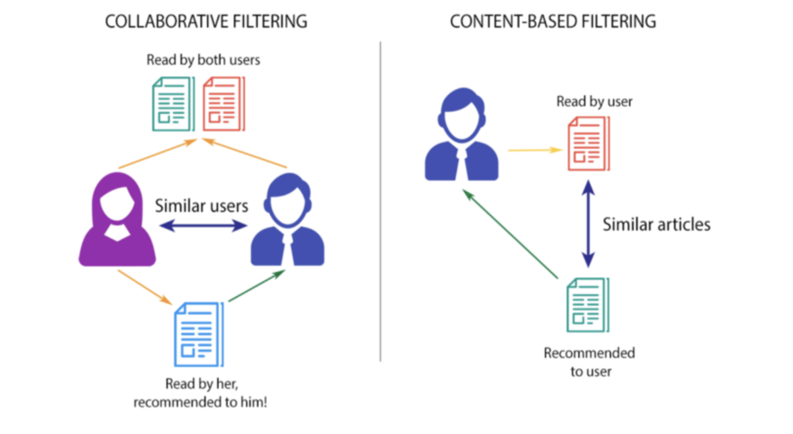

# Book Recommendation System using Cosine Similarity



> A simple book recommendation system based on user ratings and cosine similarity.

---

## Table of Contents

- [About the Project](#about-the-project)
- [Dataset](#dataset)
- [Getting Started](#getting-started)
  - [Prerequisites](#prerequisites)
  - [Installation](#installation)
- [Usage](#usage)
- [Example](#example)
- [Contributing](#contributing)
- [License](#license)
- [Contact](#contact)

---

## About the Project

This project is a book recommendation system that suggests books to users based on their ratings and cosine similarity between user preferences. It takes a dataset containing user IDs, book titles, and ratings to create personalized recommendations for users.

---

## Dataset

The dataset used for this project contains the following columns:

- User ID
- Book Title
- Ratings

You can download the dataset from (book11.csv).

---

## Getting Started

To get started with this project, follow the instructions below:

### Prerequisites

- Python (3.6 or higher)
- Jupyter Notebook (optional but recommended)

### Installation

1. Clone the repository:

```bash
git clone https://github.com/prathameshninawe/book-recommendation-system.git
